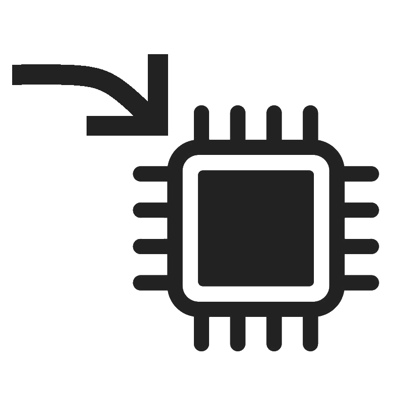
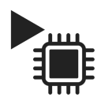

# Bridge6502
Use your laptop as ROM! Write, assemble, and upload code from Bridge6502 through an Arduino Mega directly to a 6502 CPU, or an EEPROM.

## Features
*  Allow streaming of "Laptop ROM" over usb to run onto real hardware
*  Allow use of 4kb of arduino OR device RAM, for use with the MPU
*  Relay current address and data bus bits to user GUI, stops at higher speeds.
*  Allow GUI to reset MPU, stop and run programs stepwise or at interval.
*  Added inhibit pin to allow use of device or software (arduino) RAM.
*  Added inhibit pin to allow use of device or laptop ROM.
*  Added support programming pins to program device ROM: ROM OE, WE and 6502 BE
*  Added serial data error checking, Laptop ROM tested stable at 2 Mbps.

## TO DO
*  Page programming of device EEPROM
*  Program running assembled code off of device EEPROM
*  Some more stuff

## Assembler Setup
In order to use the release, obtain a copy of `vasm6502_oldstyle.exe` (for windows) or `vasm6502_oldstyle` (for linux) and place it in 
the `assets/toolchain/` folder. You can obtain a copy from their website [here](http://www.compilers.de/vasm.html). Scroll to the
bottom of the page for binaries, or sources to compile yourself. 

## Pin Wiring
*  Address bus: A0 is address 0, A1 is address 1 etc. Uses ports K and F, do not change
*  Data bus: D22 (PA0) is data 0, D23 (PA1) is data 1 etc. Uses port A, do not change

*  6502 RW pin,            PIN_6502_RW              8
*  6502 Clock pin,         PIN_6502_CLOCK           10, must be PWM
*  6502 Reset pin,         PIN_6502_RESET           9
*  6502 Bus Enable pin,    PIN_6502_BE              38

*  EEPROM Write Enable pin, PIN_6502_ROM_WE          34
*  EEPROM Output Enable pin, PIN_6502_ROM_OE          36

*  RAM inhibit pin, PIN_6502_RAM_INHIBIT     30
*  ROM inhibit pin, PIN_6502_ROM_INHIBIT     32

To setup the inhbit pins, simply replace the wire connecting the output from
your address decoder to one of your RAM and ROMs' chip enable pins, with a 10K
Ohm resistor. On the chip enable pin that you selected, connect a wire from here
to `PIN_6502_RAM_INHIBIT` and `PIN_6502_ROM_INHIBIT` respectively. This allows the
address decoder to still select the chips, but allows the arduino to have the
final say. By setting these pins to inputs it allows for normal operation, setting
these to outputs and the opposite of their enabled state, it disables the chips and
allow for Laptop ROM and arduino RAM.

You can configure any pins except the address and data bus in the arduino sketch.
`PIN_6502_CLOCK` must be PWM for full speed running. You can also configure 
`ROM_START` and `RAM_START`, as well as `ROM_SIZE`. RAM size is defined in a 
setting sent over the bridge, or is ignored for device RAM. Lowering 
`PROPAGATION_DELAY` may result in faster operating speed. If using an NMOS 6502, 
its suggested to leave this at 50, but a WDC65c02 could have this lowered.

## Connecting to your Device
Once you have all the pins wired up into your breadboard computer, make sure you
have removed any oscillator on your 6502's clock pin. If you have one connected to
something else, like a serial chip, those are fine. Connect your arduino to your 
computer. Then open Bridge6502 and go to: `Device` -> `COM Port:` and select the
COM port your device is connected to. Next select the last saved baud rate.
The default baud rate in the arduino sketch is `19200`. Next click the 

button and wait for it to change to

. You should also see some log messages about device settings. 

## Using the Bridge
You will notice that there are two large byte viewer windows in front of you. The 
left panel is the RAM, and the right/center panel is ROM. You can edit the 
"Laptop ROM" directly here, or you can write an assembly program in the 
`Assembly View` tab. Once you finish writing your assembly program, you can
assemble it by pressing:

You can load the assembled binary into "Laptop ROM" by pressing:

You start the clock by pressing:
, 
pause it with
, 
and if the clock is not running, you can the pulse clock with
. 
You reset the 6502 with
,
or you can assemble, load binary into laptop rom, reset the 6502 and start the clock all just by pressing:
.

You can update the baud rate of the serial port on the fly, even while running a program in the `Device` menu.
A lower baud rate reduces the chance of errors. Higher error rate leads to slower overall clock rate. A rare
fatal error can occur if all error checks pass with incorrect data. This will cause an NMOS 6502 to start writing
FF and 00 to random locations in RAM. A WDC6502 tends to fill random locations in the stack. You can also set the
clock interval in us by clicking:
,
though the clock never runs faster than the serial port can obtain ROM data. In practice,
this tends to be 16kHz to 0.1Hz depending on baud, interval, and luck. NMOS 6502's seem to be reliable until you
get to less than 0.5Hz, and stepping is unreliable.

## Future Plans
In the near future, I will be adding it such that you can program the device EEPROM with the Bridge and then run
at full speed, (1MHz). I am also experimenting using a pico with buffers, maybe we could get to 1MHz all with
emulated ROM. The pico sketch included was able to output data at 1.32MHz, but I ran into issues with the buffers
outputting correctly. Since the pico has like 24 IO pins, you need to find a way to condense the data and address
pins together, so you can use the other pins for control signals.

I've also begun writing code to emulate the 6502 in software, though thats far into the future.